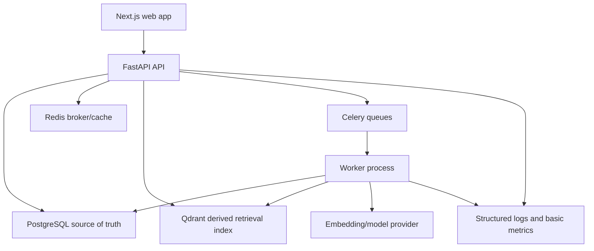

# Architecture Overview

## Current Architectural Intent

The project starts as a modular monolith with separate worker processes. This keeps product development fast while preserving clear domain boundaries and production-like async behavior.

## MVP System Diagram

## Deployable Processes

- web: Next.js frontend.
- api: FastAPI HTTP application.
- worker: Celery worker for ingestion, indexing, matching, and evaluation jobs.
- scheduler: optional Celery Beat process for scheduled evaluation or maintenance.
- migration: one-shot database migration command.

## Initial Domain Modules

- identity: users, sessions, authentication.
- tenancy: tenants, memberships, roles, permissions.
- catalogs: sources, imports, rows, status.
- products: supplier products, canonical products, variants, attributes.
- ingestion: parsing, validation, normalization, idempotency.
- retrieval: indexing, search, fusion, filters, evidence.
- matching: duplicate candidates, confidence, review cases.
- approvals: human decisions and mutation execution.
- evaluation: datasets, runs, metrics, reports.
- audit: append-only operational history.
- observability: logs, health checks, metrics hooks.

## Source of Truth

PostgreSQL owns business state. Qdrant stores derived retrieval records and can be rebuilt from PostgreSQL. Redis is used for queueing, locks, and short-lived coordination, not authoritative business state.

## Data Flow

1. User submits catalog import through the web app.
2. API validates request, records import metadata, and enqueues work.
3. Worker parses rows, validates schema, stores raw and normalized product data.
4. Worker generates retrieval records and writes them to Qdrant after PostgreSQL commits.
5. Worker generates duplicate candidates and review cases.
6. User searches products through the API; retrieval is tenant-filtered.
7. User reviews duplicate cases and approves or rejects proposed changes.
8. API executes approved mutations transactionally and records audit events.
9. Evaluation jobs compare retrieval/matching configurations against frozen manifests.

## Tenant Isolation Strategy

Every protected table includes tenant ownership directly or through a parent entity. All repository methods require tenant scope. Retrieval payloads include tenant_id, and search queries must include tenant filters. Worker payloads carry tenant context and are revalidated before state changes.

## AI Boundary

AI components may assist with embeddings, similarity, recommendations, explanations, or later agent proposals. They do not own permissions, identity, state transitions, prices, or final catalog mutation authority. Structured AI output must be validated before use.

## MVP Observability

The MVP begins with structured logs, health checks, task status, and basic metrics hooks. Full OpenTelemetry, Prometheus, Grafana, and Langfuse are deferred until core workflows work.

## Later Architecture Additions

- Separate MCP server.
- LangGraph agent worker.
- Memory module.
- Full telemetry stack.
- Kubernetes deployment.
- Real integration adapters.

These additions should be gated by measured product value and implementation readiness.

